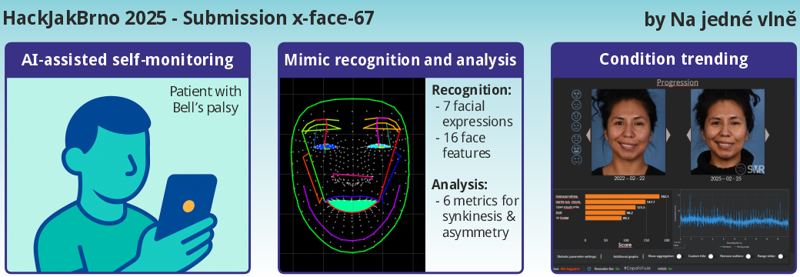

# Grimace Detection & Rehabilitation Assistant

This project is a computer vision application designed to assist in facial rehabilitation therapy. It utilizes **MediaPipe Face Mesh** for high-precision facial landmark tracking and a **Support Vector Machine (SVM)** classifier to recognize and validate specific facial exercises (grimaces) in real-time.

Developed for **Hack-Jak-Brno 2025**



Download presentation:
[Download Slides (PDF)](https://raw.githubusercontent.com/steinbachv/x-face-67/main/docs/HACK25_na_jedne_vlne.pdf)

## 🚀 Features

- **Real-time Facial Tracking**: Tracks 478 facial landmarks using MediaPipe.
- **Grimace Classification**: Detects 7 distinct facial expressions used in rehabilitation:
  - Neutral (Bez výrazu)
  - Smile (Úsměv)
  - Eyes Closed (Zavřít oči)
  - Frown (Mračit se)
  - Eyebrows Up (Zvednout obočí)
  - Mouth "I" (Obličej I)
  - Mouth "U" (Obličej U)
- **Interactive Feedback**:
  - Visual instructions that turn **green** upon successful detection.
  - GIF demonstrations for each exercise.
  - Real-time confidence scoring.
- **Dataset Collection Tool**: Built-in tool to capture and annotate new training data.

## 📂 Project Structure

- **`webcam_detect.py`**: The main application for users. Runs the webcam loop, classifies grimaces, and handles the user interface.
- **`webcam_capture.py`**: A developer tool for creating datasets. Allows capturing frames and landmark data to train the model.
- **`train_SVM.py`**: Script to train the SVM classifier using the collected CSV data.
- **`compute_features.py`**: Logic for extracting relevant geometric features from raw landmarks (e.g., eye openness, mouth width).
- **`check_symetry.py`**: Helper to analyze facial symmetry.
- **`models/`**: Directory containing the trained models (`svm_acc85.joblib`).
- **`grimaces/`**: Directory containing GIF demonstrations for the exercises.
- **`facemask_features/`**: Definitions of facial regions (polygons/lines) for visualization.

## 🛠️ Installation

1.  **Clone the repository**
2.  **Install dependencies**:
    ```bash
    pip install opencv-python mediapipe numpy scikit-learn joblib matplotlib pillow
    ```

## 🎮 Usage

### 1. Running the Detection App (User Mode)
Start the main application to practice facial exercises.

```bash
python webcam_detect.py
```

- **Instructions**: Follow the text on the screen. Mimic the GIF animation.
- **Feedback**: The text "Úkol: [Task Name]" will turn **GREEN** when the exercise is detected correctly.
- **Controls**:
  - `n`: Manually switch to the next exercise.
  - `q`: Quit the application.

### 2. Capturing Training Data (Developer Mode)
If you need to retrain the model with new data:

```bash
python webcam_capture.py
```

- **Controls**:
  - `c`: Capture the current frame and landmarks (saved to `dataset/`).
  - `q`: Quit.

### 3. Training the Model
After collecting data in the `dataset/` folder:

```bash
python train_SVM.py
```
This will generate a new `.joblib` model file in the `models/` directory.

## 🧠 How It Works

1.  **Landmark Detection**: The app captures a video frame and uses MediaPipe to find 468 facial landmarks.
2.  **Feature Extraction**: It calculates specific geometric features (distances, ratios) relevant to the grimaces (e.g., distance between lips, eyebrow height).
3.  **Classification**: These features are fed into a pre-trained SVM classifier.
4.  **Smoothing**: A majority-vote buffer smooths the predictions to prevent flickering.
5.  **Feedback**: If the predicted class matches the target exercise with high confidence, the task is marked as complete.

## 📝 License

Copyright <2025> Luboš Smolík, Jakub Šulda, Zdeněk Kubín, Václav Steinbach

Redistribution and use in source and binary forms, with or without modification, are permitted provided that the following conditions are met:

1. Redistributions of source code must retain the above copyright notice, this list of conditions and the following disclaimer.

2. Redistributions in binary form must reproduce the above copyright notice, this list of conditions and the following disclaimer in the documentation and/or other materials provided with the distribution.

3. Neither the name of the copyright holder nor the names of its contributors may be used to endorse or promote products derived from this software without specific prior written permission.

THIS SOFTWARE IS PROVIDED BY THE COPYRIGHT HOLDERS AND CONTRIBUTORS “AS IS” AND ANY EXPRESS OR IMPLIED WARRANTIES, INCLUDING, BUT NOT LIMITED TO, THE IMPLIED WARRANTIES OF MERCHANTABILITY AND FITNESS FOR A PARTICULAR PURPOSE ARE DISCLAIMED. IN NO EVENT SHALL THE COPYRIGHT HOLDER OR CONTRIBUTORS BE LIABLE FOR ANY DIRECT, INDIRECT, INCIDENTAL, SPECIAL, EXEMPLARY, OR CONSEQUENTIAL DAMAGES (INCLUDING, BUT NOT LIMITED TO, PROCUREMENT OF SUBSTITUTE GOODS OR SERVICES; LOSS OF USE, DATA, OR PROFITS; OR BUSINESS INTERRUPTION) HOWEVER CAUSED AND ON ANY THEORY OF LIABILITY, WHETHER IN CONTRACT, STRICT LIABILITY, OR TORT (INCLUDING NEGLIGENCE OR OTHERWISE) ARISING IN ANY WAY OUT OF THE USE OF THIS SOFTWARE, EVEN IF ADVISED OF THE POSSIBILITY OF SUCH DAMAGE.
